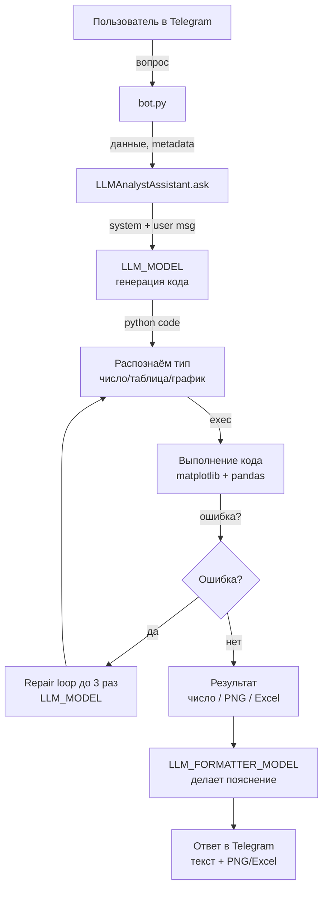

# 📊 Analytics Assistant Telegram Bot

Telegram-бот с ИИ-ассистентом для анализа данных о вакансиях и зарплатах.

## 🚀 Возможности

- 💬 Понимает вопросы на естественном языке и формулирует ответы живым текстом, а не просто числом
- 🤖 Две LLM: одна пишет код анализа, вторая объясняет результаты
- 📈 Строит графики и диаграммы
- 📊 Рассчитывает статистики (средние, медианы, распределения)
- 📋 Выгружает таблицы в Excel и прикрепляет файл
- 🔄 Автоматически исправляет ошибки в сгенерированном коде

## 📋 Требования

- Python 3.10+
- Telegram Bot Token (получить у [@BotFather](https://t.me/BotFather))
- OpenRouter API Key (получить на [openrouter.ai](https://openrouter.ai/))

## 🛠 Установка

### 1. Клонируйте репозиторий

```bash
git clone <repository-url>
cd analytics-assistant-bot
```

### 2. Создайте виртуальное окружение

```bash
python -m venv venv
source venv/bin/activate  # Linux/macOS
# или
venv\Scripts\activate  # Windows
```

### 3. Установите зависимости

```bash
pip install -r requirements.txt
```

### 4. Настройте переменные окружения

Скопируйте файл с примером и заполните своими ключами:

```bash
cp env.example .env
```

Отредактируйте `.env`:

```env
# OpenRouter API Key (https://openrouter.ai/)
OPENROUTER_API_KEY=sk-or-v1-your-api-key-here

# Telegram Bot Token (get from @BotFather)
TELEGRAM_BOT_TOKEN=your-telegram-bot-token-here

# LLM Model for code generation (optional)
LLM_MODEL=kwaipilot/kat-coder-pro:free

# LLM Model for response formatting and explanation (optional)
LLM_FORMATTER_MODEL=google/gemma-3-4b-it:free
```

## 🚀 Запуск

```bash
python bot.py
```

## 💬 Использование

После запуска бота в Telegram:

1. Найдите своего бота по username
2. Отправьте `/start` для начала работы
3. Задавайте вопросы на русском языке — бот вернет поясненный ответ, а при необходимости добавит график (PNG) или Excel-файл

### Примеры вопросов

```
📊 Статистика:
- Какая средняя зарплата для Data Engineer?
- Сколько вакансий в Москве?
- Какой процент вакансий с удалённой работой?

📈 Графики:
- Построй график распределения зарплат
- Покажи топ-10 специализаций по количеству вакансий
- Сравни зарплаты в разных городах на гистограмме

🔍 Фильтрация:
- Найди все вакансии с зарплатой больше 300000
- Какие технологии чаще всего встречаются?
```

## 🧠 Как работает

- Генерация кода: модель из переменной `LLM_MODEL` пишет Python-код для анализа DataFrame `df`.
- Исполнение: код выполняется, ошибки автоматически чинятся до 3 раз.
- Классификация результата:
  - число/метрика → форматируется и поясняется;
  - график → сохраняется в PNG и описывается словами;
  - таблица → выгружается в Excel, добавляются имя файла и текстовое описание.
- Форматирование ответа: отдельная модель из `LLM_FORMATTER_MODEL` превращает результаты в связный русский текст (масштабирует числа, добавляет пояснения).

### Схема работы LLM-агента



## 📁 Структура проекта

```
analytics-assistant-bot/
├── bot.py              # Telegram бот (Aiogram)
├── agent.py            # LLM агент для анализа данных
├── data_loader.py      # Загрузка и обработка данных
├── config.py           # Конфигурация (загрузка env)
├── metadata.json       # Метаданные о структуре данных
├── data.json           # Данные о вакансиях (загружается)
├── requirements.txt    # Python зависимости
├── env.example         # Пример файла .env
└── README.md           # Документация
```

## ⚙️ Конфигурация

| Переменная | Описание | По умолчанию |
|------------|----------|--------------|
| `OPENROUTER_API_KEY` | API ключ OpenRouter | - |
| `TELEGRAM_BOT_TOKEN` | Токен Telegram бота | - |
| `LLM_MODEL` | Модель LLM | `kwaipilot/kat-coder-pro:free` |
| `LLM_FORMATTER_MODEL` | Модель для объяснений ответов | `meta-llama/llama-3.2-3b-instruct` |
| `DATA_PATH` | Путь к файлу данных | `data.json` |
| `METADATA_PATH` | Путь к метаданным | `metadata.json` |

## 🔧 Доступные LLM модели

Через OpenRouter можно использовать разные модели:

- `kwaipilot/kat-coder-pro:free` - бесплатная модель (по умолчанию)
- `google/gemma-3-4b-it:free` - бесплатная модель для форматирования ответов (по умолчанию)
- `openai/gpt-4o` - OpenAI GPT-4o
- `anthropic/claude-3.5-sonnet` - Claude 3.5 Sonnet
- `google/gemini-pro` - Google Gemini Pro

Полный список: [openrouter.ai/models](https://openrouter.ai/models)

## 📝 Команды бота

| Команда | Описание |
|---------|----------|
| `/start` | Начать работу с ботом |
| `/help` | Справка по использованию |
| `/info` | Информация о загруженных данных |

## 🤖 Бот

Ссылка на бота: https://t.me/llm_analyst_assistant_bot 


## 🐛 Отладка

Для подробного логирования установите `verbose=True` в инициализации ассистента:

```python
assistant = LLMAnalystAssistant(
    df=df,
    openrouter_api_key=config.OPENROUTER_API_KEY,
    metadata=metadata,
    model=config.LLM_MODEL,
    verbose=True,  # Включить отладку
)
```

## 📄 Лицензия

MIT
